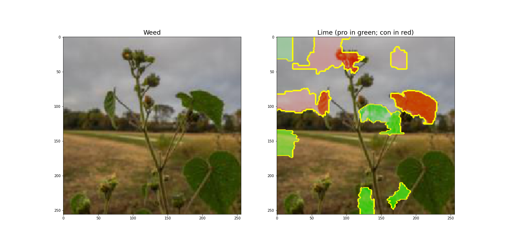

# Weed Classifier


**Author:** Marina Saito
***

## Overview and Business Problem

Gardeners and a great many homeowners have gardens.  And when they see something growing in the garden, they may want to identify the new plant they are observing to determine whether they should leave it be or if it’s a harmful or invasive species, to remove it from the garden.  A weed classifier can assist those, particularly novices, in identifying which plants to pull. 

Since the identification of a weed will ultimately result in it's removal, it is important not to misclassify perennials as weeds (i.e., to minimize false positives).  Therefore, I will focus on the precision score in evaluating my models.

## This Repository

### Repository Directory

```
├── README.md             <-- Main README file explaining the project's business case,
│                             methodology, and findings
│
├── data                  <-- Data in jpeg format
│   ├── train             <-- Training data used for modeling
│   │   ├── perennials    <-- Perennials in training data
│   │   └── weeds         <-- Weeds in training data
│   └──── test            <-- Original test data (before moving 100 images to vaidation)
│       ├── perennials    <-- Perennials in test data
│       └── weeds         <-- Weeds in training data
│
├── final_model           <-- Final model
│
├── notebooks             <-- Jupyter Notebooks for exploration and presentation
│   ├── exploratory       <-- Unpolished exploratory data analysis (EDA) notebooks
│   └── report            <-- Polished final notebook
│
├── reports               <-- Generated analysis (including presentation.pdf)
│   └── images            <-- Images used in reporting
│
└── src                   <-- Relevant source code
```

### Quick Links
1. [Final Analysis Notebook](notebooks/final/final_model.ipynb)
2. [Presentation Slides](reports/presentation.pdf)

### Setup Instructions

To create a replica of the environment needed to run my notebook, run: 

`conda env create --file xrays.yml`

## Data
### Compilation

I gathered a list of best-performing perennials in the midwest from https://www.midwestgardentips.com/best-performing-perennials-1, and I gathered a list of common weeds in IL from https://www.preen.com/weeds (see [Create Plant List & Initial Scraping Notebook](notebooks/exploratory/datasets-create_lists_&_initial_scraping.ipynb)).

I included the weed photos that were available from the Preen website in my dataset (see [Create Plant List & Initial Scraping Notebook](notebooks/exploratory/datasets-create_lists_&_initial_scraping.ipynb)).  I also used three additional sources to compile the photos for my dataset:

1.  https://garden.org collects and categorizes photographs from its members.  The plants in some of these photos were in the background (e.g., the primary focus of the photo may have been a bee instead of the plant), so some of these photos includes misleading information.   (See [Create Plant List & Initial Scraping Notebook](notebooks/exploratory/datasets-create_lists_&_initial_scraping.ipynb).)
2.  The Missouri Botanical Gardens (https://www.missouribotanicalgarden.org) provides photos of various plants, but does not include any photos of weeds.  (See [Scrape Perennials Notebook](notebooks/exploratory/datasets-scrape_from_missouri_botanical_garden.ipynb).)  The Missouri Botanical Gardens referred to the University of Massachusetts Amherst for all weed photos.
3.  The University of Massachusetts Amherst (http://extension.umass.edu/landscape/weed-herbarium/) provides photos of various weeds in its Weed Herbarium.  (See [Scrape UMass Weeds Notebook](notebooks/exploratory/datasets-scrape_weeds_from_UMass.ipynb).)

I ultimately collected 2812 photos of perennials and 2990 photos of weeds.  I randomly selected 10% of both the perennials and the weeds to include in my test dataset (see [Split Test and Training Notebook](notebooks/exploratory/datasets-split_test_&_training.ipynb)).

### Preparation

Because the training of convolutional neural networks improves with the amount of data used to train the model, I used various data augmentation techniques to artificially expand the size of my training dataset.  A range of techniques were including:
- Rotate the images +/- 30 degrees
- Zoom in and out
- Shift left and right
- Shift up and down
- Horizontal flip
- Adjust brightness

<p float = "left">
    
    
    
</p>

  


### Visual Inspection

Below are multiple examples comparing perennials (left) with weeds (right):
- The perennials appear to be more colorful than the weeds
- The perennials also appear to have larger leaves with more texture than the weeds


## Methods
### Model Development
Initially I ran two very simple models: one baseline model with a single hidden layer, and one convolutional neural network with a single hidden layer.  To review the simple models, please review my [Simple Model notebook](notebooks/exploratory/simple_models.ipynb).

I then started with a model having two convolutional layers and three dense layers as a starting point for my models.  I tried adding an additional convolutional layer and/or dense layer.  I also tried adding L2 regularization throughout the model.  To review my modeling process, please review my [Build Models Notebook](notebooks/exploratory/build_models.ipynb).

I also tried various classic algorithms on the data to determine how well they performed on the dataset.  To review the analysis on the classic algorithms, please review my [Classic Architectures notebook](notebooks/exploratory/classic_architectures.ipynb).

Finally, I tried deeper neural networks having three convolutional layers and five dense layers.  I tried using a dropout layer with the model as well as an L2 regularization layer.  I found that the deeper neural network model with the dropout layer performed better best.  To review the analysis using the deeper neural networks, please review my [Deeper Neural Network notebook](notebooks/exploratory/deeper_models.ipynb).

### Final Model
- Three convolutional layers
- Five dense layers with a 0.2 dropout layer after the first dense layer

## Results
- As depicted below
    - the validation loss did not decrease with additional epochs.  In other words, the error of the output layer during backpropagation did not decrease with additional training.
    - the validation accuracy appears to fluctuate around 65%
    - the validation precision does not increase with additional training


### Results on Test Data
- The metrics below indicate 52% accuracy and a 54% precision score on the test data


### Lime
- I implemented a package called [lime](https://github.com/marcotcr/lime) (local interpretable model-agnostic explanations) to illustrate the areas on the plants that the model focused on to classify the plant as a perennial or as a weed
- Lime highlights in the images below pros in green and cons in red
- Unfortunately, the model does focus on the plants to classify whether the plant is a perennial or a weed


### Transfer Learning Evaluation
I implemented a pretrained VGG model to determine how well a pretrained model performs on my dataset
- the validation loss did not decrease with additional epochs.
- the validation accuracy appears to fluctuate around 73%


The pretrained model performs better on the validation data than my model by approximately 8%

## Conclusion
- I created a convolutional neural network model that classifies plants as either perennials or weeds.
- The model is not performing very well
    - The accuracy of the model on the test dataset is 52% with a precision of 54% 
    - The model is not classifying the images by focusing solely on the plants
- The pretrained VGG-16 model also did not perform well on the dataset
    - Though the accuracy on the validation dataset was better, the performance on the test dataset was no better than my model
    - The accuracy of the pretrained model on the test dataset is 50% with a precision of 52% 
    - The model is not classifying the images by focusing solely on the plants

## Next Steps
- Try other pretrained models to determine whether there is a better match to the dataset
- Continue adjusting model parameters to improve model classification
- Find new sources of data
- Try implementing image segmentation to see if it's possible to develop a model that could isolate the relevant parts of the image
